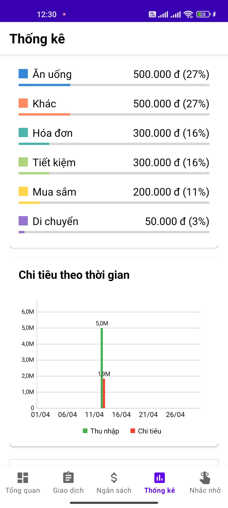
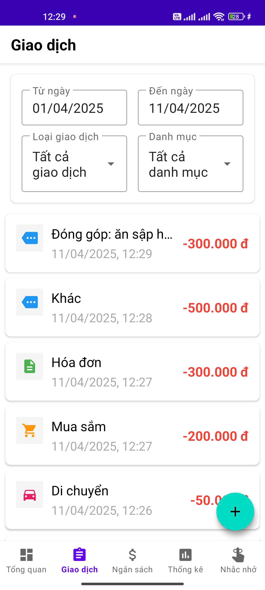
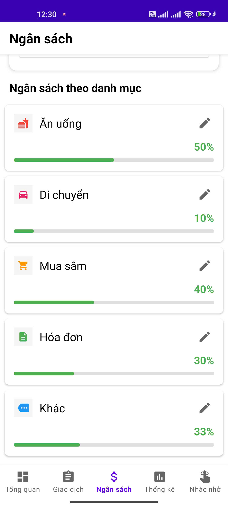
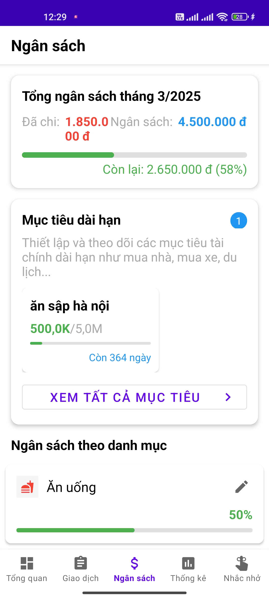
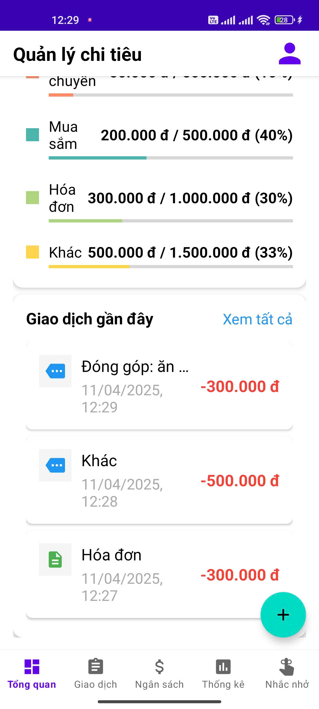
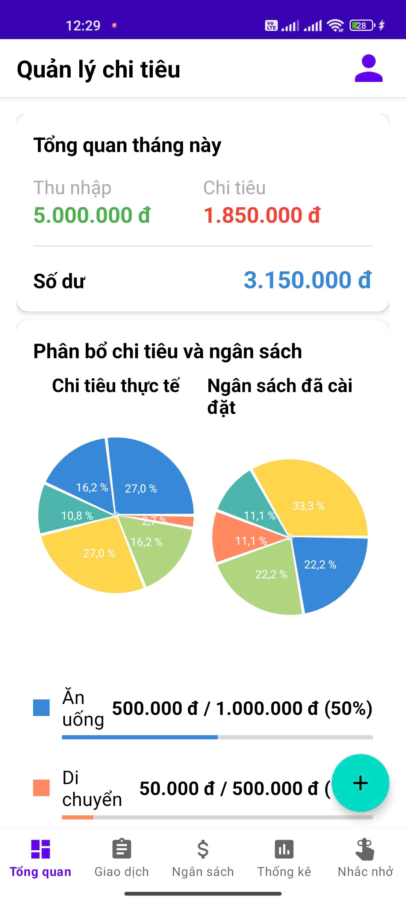
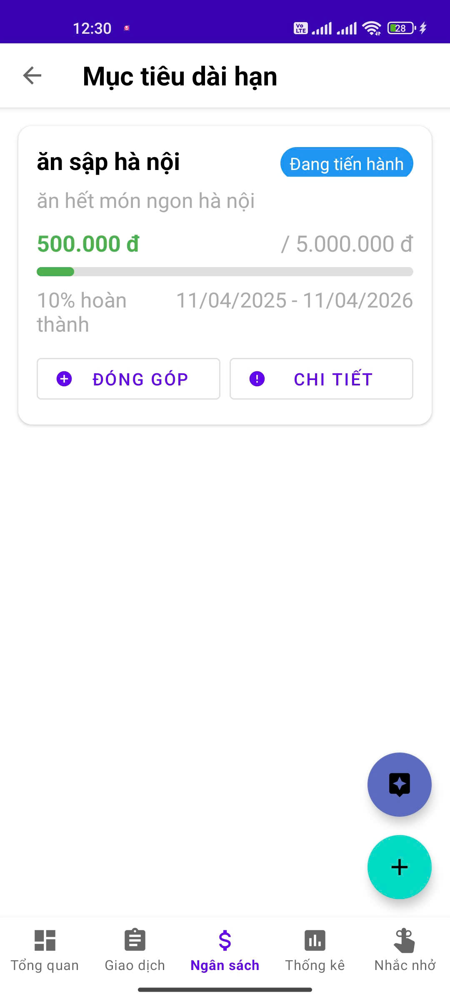
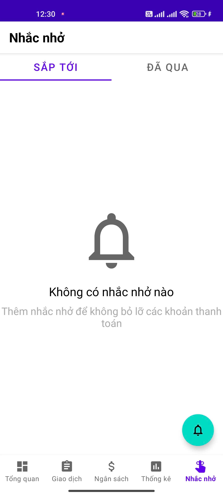
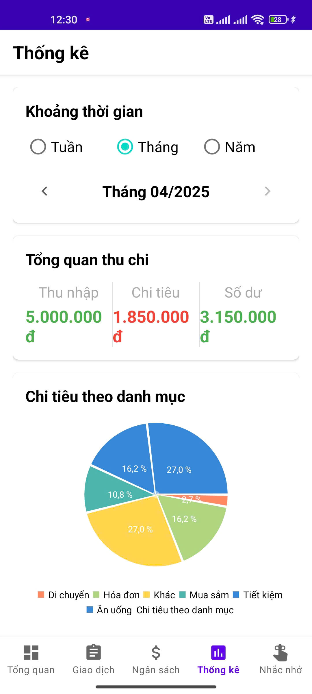

# Quản Lý Chi Tiêu

> **Lưu ý**: Ứng dụng sử dụng Firebase làm backend nên không trích xuất database. Bạn có thể tự tạo tài khoản hoặc đăng nhập bằng Google để test trực tiếp ứng dụng.

## ⚠️ Cảnh Báo
Trước khi chạy ứng dụng, bạn cần tạo 2 file cấu hình:
1. `quanlychitieu-admin/quanlychitieu-586c9-firebase-adminsdk.json` - File cấu hình Firebase Admin SDK
2. `quanlychitieu-app/app/google-services.json` - File cấu hình Firebase cho ứng dụng mobile

Vui lòng liên hệ admin để được cung cấp các file cấu hình này.

## Cách Chạy Ứng Dụng

### 1. Khởi động Web Server (API & Admin Dashboard)
1. Thêm file `quanlychitieu-586c9-firebase-adminsdk.json` vào thư mục `quanlychitieu-admin`
2. Cài đặt dependencies:
   ```bash
   cd quanlychitieu-admin
   npm install
   ```
3. Khởi động server:
   ```bash
   npm run dev
   ```
4. Kiểm tra server đang chạy ở port 3000. Nếu muốn thay đổi port, cần cấu hình lại.

### 2. Chạy Ứng Dụng Mobile
Có 2 cách để chạy ứng dụng mobile:

#### Cách 1: Chạy Local
1. Thêm file `google-services.json` vào thư mục `quanlychitieu-app/app`
2. Kiểm tra cấu hình port trong file `data/api/ApiClient.java` để đảm bảo khớp với port của server
3. Build và chạy ứng dụng

#### Cách 2: Cài đặt trực tiếp
- Sử dụng file APK có sẵn để cài đặt trực tiếp trên thiết bị

## Demo Ứng Dụng

### Mobile App










